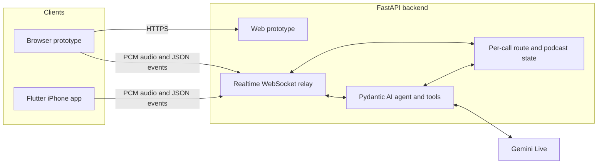
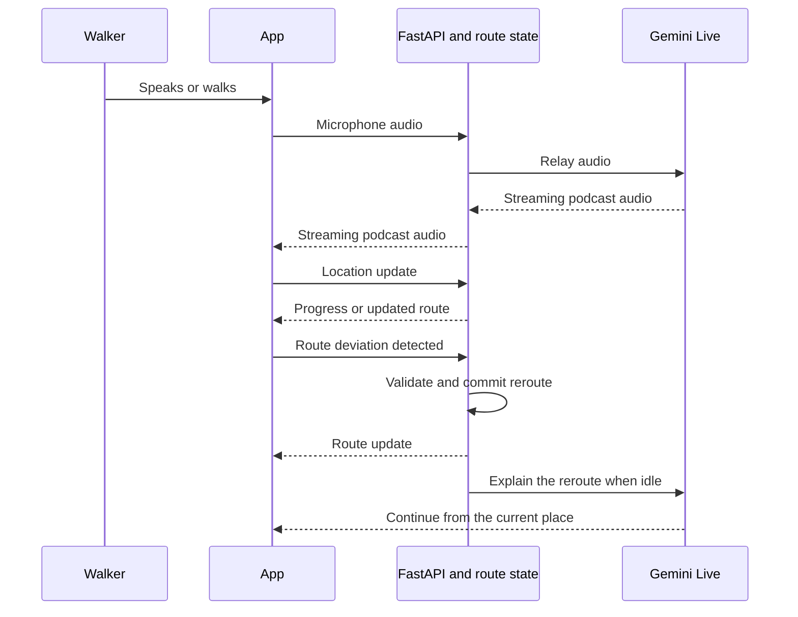

# Gradient

**A location-aware walking tour hosted as a live podcast.**

Gradient turns a time limit and a set of interests into a walk through a
neighbourhood. While the user walks, two hosts tell stories about the place
they are actually near. The user can interrupt, change the subject, take a
different street, or ask for food, and the route and conversation adapt.

[Open the deployed web prototype](https://patrick91--gradient-walking-podcast-web.eu-west.modal.run/)

> Hackathon prototype. The routes, places, and stories used by the demo are
> fixed test data around Chinatown and Soho.

## What the prototype demonstrates

The current demo follows the product loop from end to end:

1. Start a walk from Chinatown with a 25-minute time limit.
2. Generate a route and begin a live Gemini podcast.
3. Interrupt the hosts or ask to switch the conversation to music.
4. Report a wrong turn and reroute from the walker's current position.
5. Ask the walker for a photo at a stop.
6. Finish the walk and keep the route, answers, and photos.

The browser presents this as a horizontal storyboard so every stage is visible.
Only the current stage is active. The Flutter app implements the same product
as a native iPhone flow with Apple Maps, location, camera, local narration, and
an experimental live voice call.

## Architecture



The FastAPI process serves the browser prototype and owns the API key. Each
`/gemini/voice` WebSocket creates an isolated walk session and a Gemini Live
session through Pydantic AI. This gives the conversation access to route tools
without exposing provider credentials to either client.

Three kinds of data move through the system:

| Path | Transport | Purpose |
| --- | --- | --- |
| Live audio | Binary WebSocket frames | PCM16 microphone audio goes to Gemini at 16 kHz; model audio returns at 24 kHz. |
| Walk events | JSON on the same WebSocket | Transcripts, tool activity, location progress, route changes, interruption, and playback state. |
| Photos | Local capture today; upload API planned | Associate a still image with the active walk, verify the place, then feed the result back into the conversation. |

User intent and physical state take different paths. A sentence such as
“Can we talk about music?” lets Gemini call the `change_topic` tool. GPS updates
do not need a model decision: the app detects a sustained deviation, sends a
structured `route_deviation` event, and the backend commits a new route. Gemini
then explains that already-committed change at the next speech boundary.



Narration is anchored to location. Completing a spoken segment does not advance
the route; reaching the next stop or committing a reroute does. This keeps a
long podcast session talking about the place around the walker instead of
describing stops they have not reached.

See [the full walking, rerouting, and photo flow](web/docs/walking-podcast-flow.md)
for the intended product architecture.

## Repository layout

| Path | Role |
| --- | --- |
| [`app/`](app/README.md) | Flutter iPhone app: native product flow, Apple Maps, GPS, camera, keepsakes, local narration, and the Gemini relay client. |
| [`web/`](web/README.md) | FastAPI backend, Pydantic AI tools, Gemini Live relay, route state, tests, and the browser storyboard. |
| [`web/docs/`](web/docs/walking-podcast-flow.md) | Product flow diagrams for location, rerouting, narration, and photo verification. |

## Run the web prototype and backend

The backend requires [uv](https://docs.astral.sh/uv/) and Python 3.13 or newer.

```sh
cd web
cp .env.example .env
# Add GOOGLE_API_KEY to .env
uv run uvicorn main:app --host 127.0.0.1 --port 8888
```

Open <http://127.0.0.1:8888>. The visual flow and fake events work without an
API key; live Gemini audio requires `GOOGLE_API_KEY`.

## Run the Flutter app

Flutter uses a build-time WebSocket URL. A real iPhone is required for live
microphone and speaker audio; the iOS simulator can exercise signalling and the
rest of the product flow.

```sh
cd app
flutter pub get
flutter run \
  --dart-define=PYDANTIC_WS_URL=wss://patrick91--gradient-walking-podcast-web.eu-west.modal.run/gemini/voice
```

To use the local backend in the simulator, set the URL to
`ws://127.0.0.1:8888/gemini/voice`. A physical iPhone must use the Mac's LAN IP
instead of `127.0.0.1`.

## Current implementation boundary

| Capability | Browser and backend | Flutter app |
| --- | --- | --- |
| Live Gemini audio and barge-in | Implemented | Implemented on a real iPhone |
| Pydantic AI route and preference tools | Implemented with fake Soho data | Available through the live call |
| Structured location and route-deviation events | Implemented and rehearsable | GPS arrival is implemented; forwarding deviation events is next |
| Route generation | Deterministic demo routes | `MockTourGenerator` with hand-written Soho content |
| Narration | Gemini Live | Scripted iOS TTS, paused while a live call owns the audio session |
| Photo capture | Simulated in the storyboard | Captured and stored locally |
| Vision verification and conversation callback | Designed, not implemented | Designed, not implemented |

The split is deliberate for the prototype: the live agent interaction can be
tested now, while deterministic route, location, and camera flows remain usable
without a model connection.
