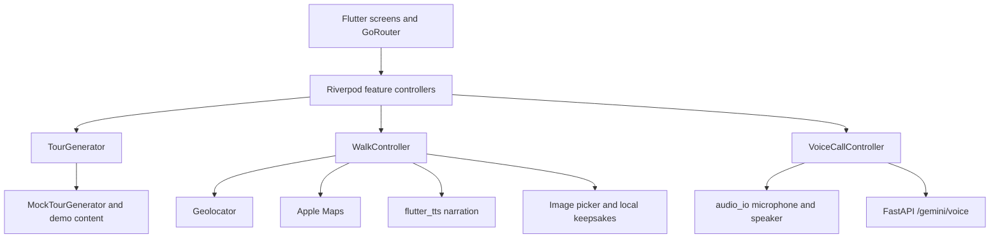

# Gradient iPhone app

The Flutter app is the native version of Gradient: a walking route presented as
a podcast. It combines Apple Maps, live location, scripted two-host narration,
questions, camera prompts, and a locally saved keepsake. It can also open a live
Gemini conversation through the FastAPI WebSocket relay in [`../web`](../web/README.md).

> Hackathon prototype. iOS only.

## Product flow

1. **Create** a walk from the user's location and preferences.
2. **Generate** the route and story stops.
3. **Preview** the route and stop list on Apple Maps.
4. **Walk** to each stop, listen, answer a question, and take a photo.
5. **Talk to the hosts** through the live Gemini relay when the user wants to
   interrupt, ask a question, or change the subject.
6. **Keep** the route, photos, score, and sources in a local keepsake.

## App architecture



The code is organised by feature under `lib/features/`. Riverpod owns the
mutable request, current tour, active walk, voice call, and keepsake state;
`go_router` connects the welcome, home, generating, preview, walk, summary, and
voice-test screens.

`TourGenerator` is the seam for real route generation. The current
`MockTourGenerator` builds hand-written Soho tours, while the backend-backed
implementation can later replace that provider without changing the screens.

`WalkController` listens to location updates and advances through navigation,
story, quiz, photo, and finish phases. Arrival is automatic within 35 metres or
can be confirmed manually. It currently uses local `flutter_tts` scripts for
the two hosts.

`VoiceCallController` owns one realtime call. It streams PCM microphone audio
to the backend, plays Gemini audio, records transcripts and tool activity, and
supports interruption. The walk controller pauses local narration while the
call owns the iOS audio session, then resumes from the same line after the call.

## Run

```sh
flutter pub get
flutter run
flutter test
```

Location, microphone, camera, and photo-library permissions are declared in
`ios/Runner/Info.plist`.

### Connect to the deployed live relay

The WebSocket URL is supplied at build time:

```sh
flutter run \
  --dart-define=PYDANTIC_WS_URL=wss://patrick91--gradient-walking-podcast-web.eu-west.modal.run/gemini/voice
```

For a backend running locally on port 8888:

```sh
flutter run \
  --dart-define=PYDANTIC_WS_URL=ws://127.0.0.1:8888/gemini/voice
```

That localhost URL works in the iOS simulator. A physical iPhone must use the
Mac's LAN IP, for example `ws://192.168.1.20:8888/gemini/voice`, and both devices
must be able to reach each other.

The iOS simulator runs the live call in signalling-only mode because the
`audio_io` voice-processing path requires real audio hardware. Use a physical
iPhone to test microphone capture, model audio, and barge-in.

## Realtime protocol

The app connects to `/gemini/voice` using protocol version 1:

- client audio: raw PCM16 little-endian mono at 16 kHz;
- server audio: raw PCM16 little-endian mono at 24 kHz;
- JSON events: readiness, transcripts, tool activity, output clearing, turn
  completion, reconnection, ping/pong, and errors;
- client controls currently emitted by Flutter: `ping`, `interrupt`, and
  `close`.

The backend already accepts `location_update` and `route_deviation`, but the
Flutter client does not forward them yet. The next integration step is to add
those messages to `relay_protocol.dart` and drive them from the location stream
with an off-route debounce.

## Current implementation boundary

- Tour generation uses `MockTourGenerator` and hand-written content in
  `lib/features/tour/data/demo_tours.dart`.
- Directions use distance, compass bearing, and a written hint rather than
  turn-by-turn routing.
- The main walk uses two on-device iOS voices. Live Gemini is available as an
  interruptible call from the walk and through the voice test screen.
- Photos are captured and saved locally. Server-side vision verification and a
  callback into the active conversation are part of the target architecture,
  not the current app.
- Keepsakes are stored on the device.

See the [system architecture](../README.md#architecture) and the
[walking-podcast flow](../web/docs/walking-podcast-flow.md) for how the mobile
client, route state, Gemini Live conversation, and future photo checker fit
together.
