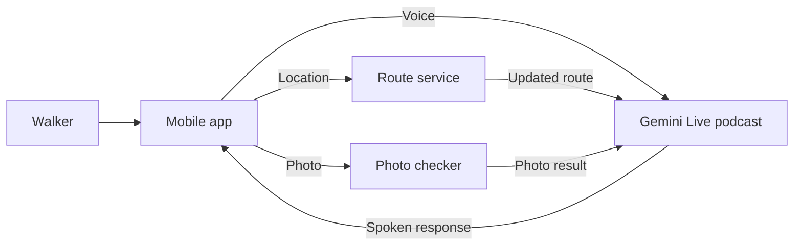
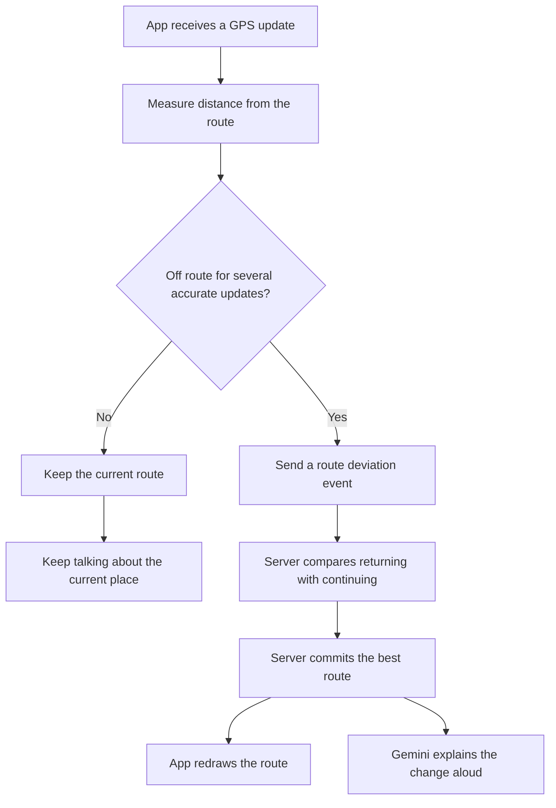
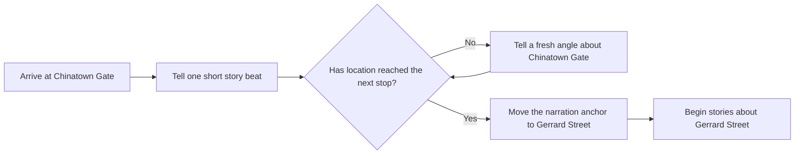
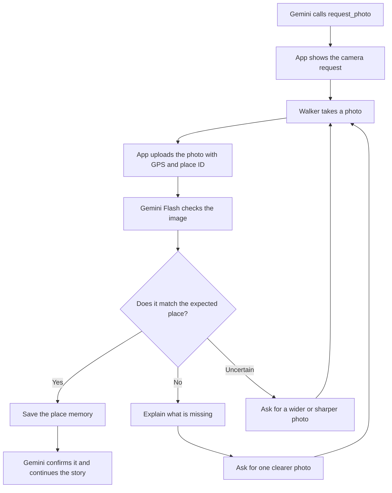

# Walking podcast: the flow we want to build

The voice call stays open throughout the walk. Location and photos travel to
the backend alongside that call, and their results are fed back into the same
conversation.

## The whole system



There are three parallel data paths:

- Voice stays connected to Gemini Live.
- The app watches location and the backend updates the route.
- A separate vision request checks a still photo and returns the result to the
  live conversation.

## Normal walking and a wrong turn



The app performs the quick detection. A useful starting rule is **30–50 metres
away from the route for three accurate GPS updates**. The server makes the
final rerouting decision.

This automatic path does not need a model tool call. A model tool is still
useful when the walker explicitly asks, “Can we go through Berwick Street?”

## Narration stays tied to location



Finishing a narration turn never moves the story to another place. Only a
location update or a committed reroute changes the narration anchor.

## Asking for and checking a photo



The `request_photo` tool returns immediately; it does not wait while the walker
uses the camera. The server stores a pending photo request and reconnects the
result using its request ID.

The photo upload is outside the PCM audio stream, but it remains part of the
same walk and conversation:

```text
Live call asks for photo
  → app opens camera
  → backend checks photo
  → result enters the live call
  → Gemini answers aloud
```

## Who owns each decision

| Decision | Owner | How it reaches the conversation |
| --- | --- | --- |
| User started speaking | Gemini Live | Voice activity detection |
| Current location | App | Location event |
| Possibly off route | App | Local distance check and debounce |
| New route | Backend | Route update event |
| Continue narration at the current place | Backend session state | Narration prompt |
| Ask for a photo | Model | `request_photo` tool |
| Capture and upload photo | App | Camera plus upload endpoint |
| Decide whether the photo matches | Gemini Flash vision | Structured photo result |
| Confirm or request another photo | Gemini Live | Spoken response |

